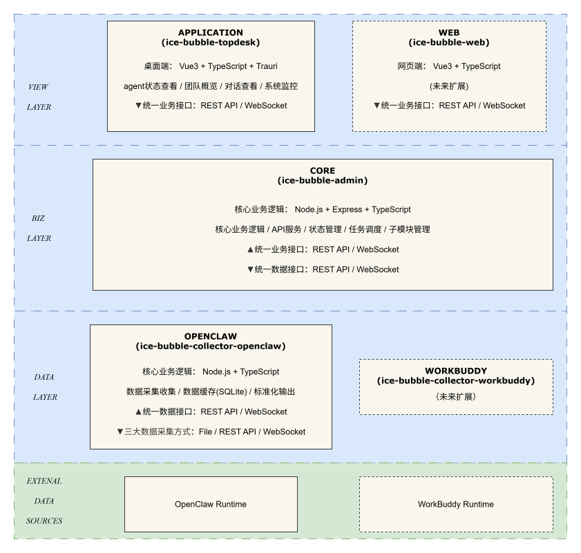

<div align="center">

<h1>ice-bubble</h1>

[](https://nodejs.org/)
[](https://www.typescriptlang.org/)
[](https://opensource.org/licenses/MIT)
[](https://github.com/SakuraSmiles/ice-bubble)
[](https://github.com/SakuraSmiles/ice-bubble)
[](https://github.com/SakuraSmiles/ice-bubble)


> ice-bubble 多 Agent 团队协作管理系统 — 三层架构：数据采集 · 业务核心 · 桌面展示

**模块版本**

> admin `1.2.1` · collector `1.1.2` · desktop `1.3.1`

</div>

---

## 项目简介

ice-bubble 采用模块化结构，提供 OpenClaw 的功能扩展。

---

## 核心模块

| 层级 | 模块 | 版本 | 说明 |
|------|------|------|------|
| **VIEW LAYER** | **ice-bubble-desktop** | `1.3.1` | 桌面端展示应用（Tauri + Vue3 + Element Plus），面向最终用户 |
| **BIZ LAYER** | **ice-bubble-admin** | `1.2.1` | 核心业务逻辑（API 服务、模块管理、数据同步），整体内聚 |
| **DATA LAYER** | **ice-bubble-collector-openclaw** | `1.1.2` | OpenClaw 数据采集器，封装输入输出，暴露标准接口，可水平扩展 |

> DATA LAYER 设计为可插拔：未来新增数据源（如 WorkBuddy）只需实现标准接口的 Collector 即可。

---

## 架构图

<div align="center">



</div>

---

## 文档导航


| 文档 | 说明 |
|------|------|
| [desktop](./ice-bubble-desktop/README.md) | 桌面端展示应用详细文档 |
| [admin](./ice-bubble-admin/README.md) | 核心业务模块详细文档 |
| [collector-openclaw](./ice-bubble-collector-openclaw/README.md) | 数据采集模块详细文档 |
| [接入规范](./docs/integration.md) | 模块接入标准和规范 |

---

## 项目结构

```
ice-bubble/
├── .gitattributes
├── .gitignore
├── LICENSE
├── README.md
├── data/                              ← 运行时数据（SQLite 等）
├── docs/
│   ├── ice-bubble.drawio.svg         ← 系统架构图
│   └── integration.md                 ← 模块接入规范
├── skills/                            ← OpenClaw Skills（任务管理等）
├── ice-bubble-admin/                  ← BIZ LAYER：核心业务逻辑
│   ├── README.md
│   ├── config/
│   ├── src/
│   └── docs/
├── ice-bubble-collector-openclaw/     ← DATA LAYER：OpenClaw 数据采集器
│   ├── README.md
│   ├── config/
│   ├── src/
│   ├── tests/
│   └── docs/
└── ice-bubble-desktop/                ← VIEW LAYER：桌面端展示应用
    ├── README.md
    ├── .env.example
    ├── src/
    └── src-tauri/
```

## 服务端口

| 模块 | 端口 | 说明 |
|------|------|------|
| desktop 前端 | 1420 | Vite Dev Server（开发）/ Tauri 窗口（生产） |
| admin | 13000 | 业务 API |
| collector | 13100 | 数据采集 API |
| task | 13102 | 任务管理 API（已废弃，由 subagent sessions 替代） |

## 快速开始

### 启动依赖顺序

```
1. collector-openclaw  (13100)  — 数据源，最先启动
2. admin              (13000)  — 依赖 collector，提供业务 API
3. desktop            (1420)   — 前端展示，直连 admin
```

> 注：原 task 服务（13102）已废弃，功能由 subagent sessions 替代，相关配置保留但已禁用。

### 启动命令

```bash
# 根目录没有统一的 dev 脚本，请分别启动各子模块：

# 1. 数据采集层
cd ice-bubble-collector-openclaw && npm run dev

# 2. 业务管理层（另起终端）
cd ice-bubble-admin && npm run dev

# 3. 桌面端（另起终端）
cd ice-bubble-desktop && npm run dev
```

> 生产模式使用 `npm run tauri dev` 启动 Desktop（Tauri 窗口）。

### 认证配置

所有 API 服务（admin / collector）支持可选的 Bearer Token 认证。

**配置方式（环境变量优先）：**

```bash
# 方式一：环境变量（推荐，生产环境使用）
export ICE_AUTH_TOKEN="your-secret-token"

# 方式二：config.json 备用（仅开发环境使用）
# 在各模块的 config/config.json 中添加：
# {
#   "auth": { "token": "your-secret-token" }
# }
```

**Desktop 前端配置：**

通过 Desktop 的 Setup 页面（`/setup`）或直接在浏览器 localStorage 中配置 Auth Token，无需 `.env` 文件。

---

## systemd 服务配置（生产环境）

项目在 `systemd/` 目录下提供了 user 级 systemd service 模板，适用于 Linux/macOS/WSL 生产环境长期运行。

### 安装步骤

```bash
# 1. 复制 service 文件到用户 systemd 目录
mkdir -p ~/.config/systemd/user
cp ice-bubble/systemd/ice-bubble-collector.service ~/.config/systemd/user/
cp ice-bubble/systemd/ice-bubble-admin.service ~/.config/systemd/user/

# 2. 重新加载 systemd
systemctl --user daemon-reload

# 3. 启用并启动服务（按依赖顺序）
systemctl --user enable ice-bubble-collector.service
systemctl --user start ice-bubble-collector.service

systemctl --user enable ice-bubble-admin.service
systemctl --user start ice-bubble-admin.service

# 4. 检查服务状态
systemctl --user status ice-bubble-collector.service
systemctl --user status ice-bubble-admin.service
```

### 服务说明

| 服务文件 | 说明 | 端口 |
|---------|------|------|
| `ice-bubble-collector.service` | OpenClaw 数据采集器 | 13100 |
| `ice-bubble-admin.service` | 核心业务逻辑（依赖 collector） | 13000 |

### 常见操作

```bash
# 重启服务
systemctl --user restart ice-bubble-collector.service
systemctl --user restart ice-bubble-admin.service

# 查看日志
journalctl --user -u ice-bubble-collector.service -f
journalctl --user -u ice-bubble-admin.service -f

# 停止服务
systemctl --user stop ice-bubble-collector.service
systemctl --user stop ice-bubble-admin.service
```

### 注意事项

- service 文件使用 `Environment=` 硬编码了 dabai 的数据目录路径，部署到其他机器需相应修改
- macOS 上可用 `launchctl` 替代 systemd，或使用 PM2

---

## License

MIT © SakuraSmiles
