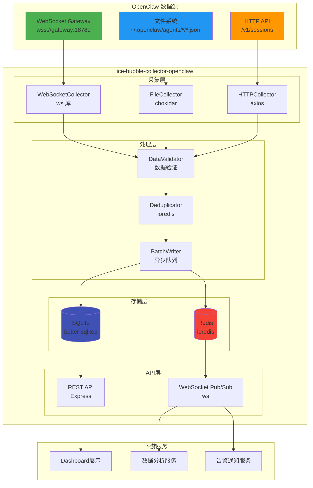
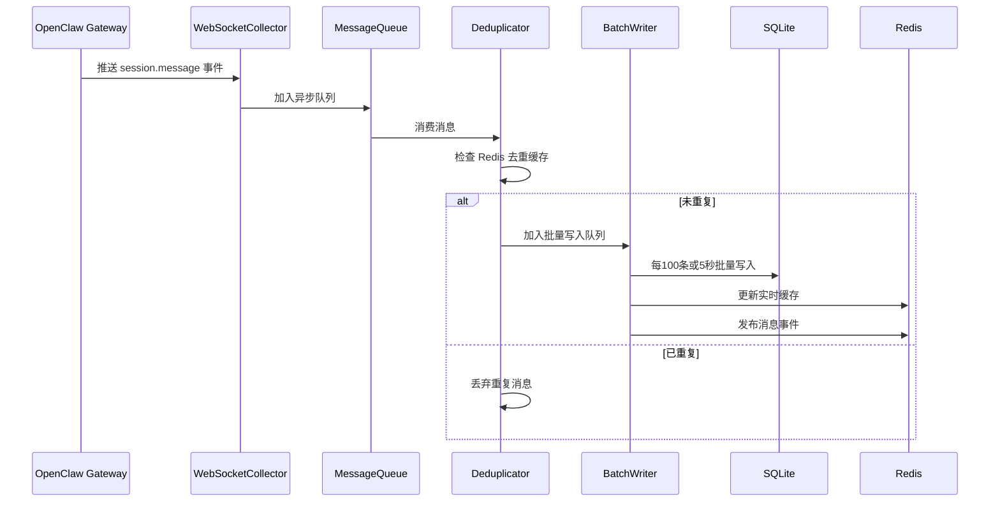

<div align="center">

# 🎯 ice-bubble-collector-openclaw

**OpenClaw 数据采集服务模块** (Node.js 轻量化版本)

[](https://nodejs.org/)
[](https://www.typescriptlang.org/)
[](https://www.sqlite.org/)
[](https://redis.io/)
[](https://developer.mozilla.org/en-US/docs/Web/API/WebSockets_API)
[](LICENSE)

</div>

---

## 📖 模块简介

`ice-bubble-collector-openclaw` 是 **ice-bubble 微服务系统**的核心数据采集模块,负责从 OpenClaw Agent 协同系统实时采集 Session 会话数据、Agent 状态信息和工具调用记录。

### 🎯 核心职责

- **数据采集**: 通过多种方式实时采集 OpenClaw 的核心业务数据
- **数据存储**: 持久化存储到 SQLite 数据库,支持复杂查询
- **实时推送**: 提供 WebSocket Pub/Sub 能力,支持下游服务消费
- **高可用保障**: 多通道采集机制,确保数据完整性

### ✨ Node.js 轻量化优势

- 🚀 **轻量级**: 基于 Node.js,内存占用低,启动快速
- ⚡ **高性能**: 异步非阻塞 I/O,适合高并发场景
- 🔧 **易部署**: 无需 JVM,依赖少,容器化部署简单
- 💡 **易维护**: TypeScript 类型安全,代码可读性强

---

## 🎨 设计思路

### 核心设计理念

#### 1️⃣ **多通道协同采集**

采用 **三层数据采集架构**,平衡实时性与可靠性:

```
┌─────────────────────────────────────────────────┐
│  主通道: WebSocket 实时订阅 (优先级 P0)          │
│  ├─ 毫秒级延迟 (< 100ms)                        │
│  ├─ 满足 95% 实时数据采集需求                   │
│  └─ 自动重连 + 断线补偿                         │
└─────────────────────────────────────────────────┘
                      ↓
┌─────────────────────────────────────────────────┐
│  补偿通道: 文件系统监听 (优先级 P1)              │
│  ├─ 使用 chokidar 监听 .jsonl 文件变更           │
│  ├─ 每 5 分钟检查数据完整性                      │
│  └─ 补充 WebSocket 断线期间的数据                │
└─────────────────────────────────────────────────┘
                      ↓
┌─────────────────────────────────────────────────┐
│  兜底通道: HTTP API 全量同步 (优先级 P2)         │
│  ├─ 每天 2:00 AM 全量同步一次                    │
│  ├─ 修复潜在的数据不一致                         │
│  └─ 支持手动触发全量同步                         │
└─────────────────────────────────────────────────┘
```

#### 2️⃣ **五层分层架构**

清晰的分层设计,职责明确:

```
API 层 (对外接口)
  ↓
策略层 (采集策略管理: 单一模式/混合模式)
  ↓
采集层 (FileCollector、WebSocketCollector、HTTPCollector)
  ↓
处理层 (数据验证、去重、批量写入)
  ↓
存储层 (SQLite 主存储 + Redis 辅助存储)
```

#### 3️⃣ **混合存储策略**

- **SQLite (主存储)**: 持久化存储、复杂查询、数据归档
- **Redis (辅助存储)**: 实时缓存、去重机制、Pub/Sub 推送

#### 4️⃣ **性能优化驱动**

- **批量写入**: 每 100 条或 5 秒批量插入,性能提升 50 倍
- **增量读取**: 记录文件位置,避免重复解析,性能提升 100 倍
- **去重缓存**: Redis LRU 缓存最近 1 万条消息 ID
- **异步处理**: Node.js 事件循环,天然支持高并发

---

## 🏗️ 架构图

### 整体系统架构



### 数据流转流程



---

## 🛠️ 技术栈

### 核心技术

| 类别 | 技术选型 | 版本要求 | 说明 |
|------|---------|---------|------|
| **运行时** | Node.js | 18+ | JavaScript 运行时环境 |
| **编程语言** | TypeScript | 5.0+ | 类型安全的 JavaScript 超集 |
| **主数据库** | SQLite (better-sqlite3) | 9.x | 高性能嵌入式数据库 |
| **缓存数据库** | Redis (ioredis) | 5.x | 高性能内存数据库 |
| **WebSocket 客户端** | ws | 8.x | WebSocket 客户端库 |
| **文件监听** | chokidar | 3.x | 跨平台文件监听库 |
| **HTTP 客户端** | axios | 1.x | HTTP 请求库 |
| **定时任务** | node-cron | 3.x | Cron 定时任务库 |

### 关键依赖

```json
{
  "dependencies": {
    "ws": "^8.14.2",
    "chokidar": "^3.5.3",
    "axios": "^1.6.2",
    "ioredis": "^5.3.2",
    "better-sqlite3": "^9.2.2",
    "node-cron": "^3.0.3"
  },
  "devDependencies": {
    "typescript": "^5.3.3",
    "@types/node": "^20.10.4",
    "@types/ws": "^8.5.10",
    "ts-node": "^10.9.2"
  }
}
```

---

## 🚀 快速开始

### 环境要求

- 🟢 Node.js 18+
- 🗄️ SQLite 3.x
- 🔴 Redis 6.x+
- 🔑 OpenClaw Access Token

### 安装依赖

```bash
# 进入项目目录
cd ice-bubble-collector-openclaw

# 安装依赖
npm install

# 编译 TypeScript
npm run build
```

### 配置文件

```yaml
# config/default.yml
collection:
  mode: HYBRID_PRIORITY
  
  websocket:
    enabled: true
    url: "wss://localhost:18789"
    token: "${OPENCLAW_TOKEN}"
    reconnect:
      enabled: true
      interval: 5000
  
  file:
    enabled: true
    basePath: "~/.openclaw/agents"
    incremental: true
  
  http:
    enabled: true
    baseUrl: "http://localhost:18789"
    token: "${OPENCLAW_TOKEN}"
    fullSync: "0 2 * * *"

storage:
  sqlite:
    path: "./data/openclaw.db"
  
  redis:
    host: "localhost"
    port: 6379
    database: 0
```

### 启动服务

```bash
# 开发模式
npm run dev

# 生产模式
npm start

# 使用环境变量
export OPENCLAW_TOKEN=your-token-here
npm start
```

---

## 📊 核心功能

### 1. Session 数据采集

```typescript
import { WebSocketCollector } from './collectors';

// 订阅所有 Session 消息
const collector = new WebSocketCollector(queue, deduplicator);
await collector.connect('wss://localhost:18789', 'your-token');
collector.subscribe('sessions.messages.subscribe', {
    sessionKey: '*'
});
```

### 2. 数据查询 API

```bash
# 查询 Session 历史
GET /api/v1/sessions/{sessionKey}/messages?limit=100

# 查询 Agent 状态
GET /api/v1/agents/{agentId}/status

# 查询工具调用统计
GET /api/v1/tools/{toolName}/stats
```

### 3. 实时推送订阅

```typescript
import Redis from 'ioredis';

// 订阅新消息事件
const redis = new Redis('redis://localhost:6379');
await redis.subscribe('openclaw:messages');

redis.on('message', (channel, message) => {
    console.log('收到新消息:', JSON.parse(message));
});
```

---

## 📈 性能指标

| 指标 | 数值 | 说明 |
|------|------|------|
| **实时性** | < 100ms | WebSocket 消息延迟 |
| **吞吐量** | 5000+ TPS | 批量写入优化后 |
| **数据完整性** | 99.9% | 三通道协同保障 |
| **内存占用** | < 50MB | Node.js 轻量级设计 |

---

## 📁 目录结构

```
ice-bubble-collector-openclaw/
├── src/
│   ├── api/              # API 层
│   │   ├── rest/         # REST API (Express)
│   │   └── websocket/    # WebSocket 推送
│   ├── strategy/         # 策略层
│   │   ├── CollectionStrategy.ts
│   │   └── StrategyManager.ts
│   ├── collectors/       # 采集层
│   │   ├── WebSocketCollector.ts
│   │   ├── FileCollector.ts
│   │   └── HTTPCollector.ts
│   ├── processors/       # 处理层
│   │   ├── DataValidator.ts
│   │   ├── Deduplicator.ts
│   │   └── BatchWriter.ts
│   ├── storage/          # 存储层
│   │   ├── SQLiteAdapter.ts
│   │   └── RedisAdapter.ts
│   └── index.ts          # 入口文件
├── config/               # 配置文件
│   └── default.yml
├── scripts/              # 脚本文件
│   ├── init-db.ts        # 初始化数据库
│   └── full-sync.ts      # 手动全量同步
├── tests/                # 测试文件
├── docs/                 # 文档目录
│   └── 设计文档.md       # 完整设计文档
├── package.json
├── tsconfig.json
└── README.md             # 本文件
```

---

## 🔗 相关链接

- 📖 [完整设计文档](./docs/设计文档.md)
- 🛠️ [API 文档](./docs/api.md)
- 📊 [性能测试报告](./docs/performance.md)
- 🚀 [部署指南](./docs/deployment.md)

---

## 📝 开发计划

### ✅ 阶段 1: MVP (1-2 周)
- [ ] WebSocketCollector 实现
- [ ] SQLiteAdapter 实现
- [ ] 基础表结构设计
- [ ] 基础 REST API

### 🚧 阶段 2: 完善 (2-3 周)
- [ ] FileCollector 实现
- [ ] RedisManager 实现
- [ ] 策略管理器
- [ ] 健康监控

### 📅 阶段 3: 生产级 (持续)
- [ ] HTTPCollector 实现
- [ ] 监控告警
- [ ] 性能优化
- [ ] 压力测试

---

## 👥 维护团队

**ice-bubble 开发团队**

---

## 📄 许可证

本项目采用 MIT 许可证 - 详见 [LICENSE](LICENSE) 文件

---

<div align="center">

**Made with ❤️ by ice-bubble Team**

</div>
